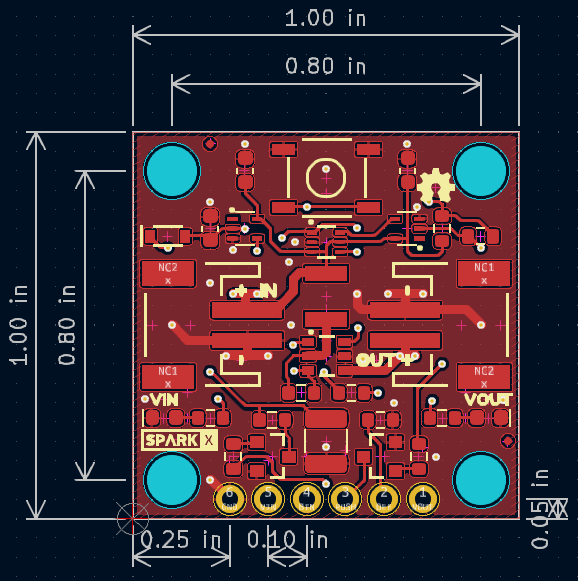

SparkX Soft Power Switch Mk2
===================================================

[*SparkX Soft Power Switch Mk2 (SPX-25365)*](https://www.sparkfun.com/products/25365)

The Soft Power Switch Mk2 is a passive, hard on/off switch with software feedback and control. In other words, it's like the on/off switch on a laptop. A simple press will turn the system on. Another press can (with MCU intervention) turn off the system. And if things go really wrong, pressing and holding the button for ~10 seconds will force a power-down. If you're building something with an enclosed battery and need a good power button, this is the board you need.

The [Mk1 Soft Power Switch](https://www.sparkfun.com/products/17870) is great, but we do see occasional issues caused by component tolerances or the operating temperature. Mk2 is based on an application note by Texas Instruments, and is a completely digital design. It is based around a 74LVC1G175 D-type flip-flop - remember those?! - and is insensitive to temperature and component variation. It also includes improvements like: an over-current self-resetting 2A fuse; input and output LEDs. This version has JST 2mm battery connectors, but we also have a version with [USB-C](https://www.sparkfun.com/products/25366) connectors.

The PUSH pin can act as an output to a microcontroller indicating the state of the power button (high = not pressed, low = user is pressing power button). This can be used as an input to your firmware to begin to shut down before power is lost. PUSH is an open-drain output and requires a pull-up. Alternatively, the OFF pin can be driven **high** by the system forcing fast power off via software. (For Mk1, the Fast Off pin was driven **low**.)

The most common use case is something like this:

* Microcontroller begins running code and checks to see if the power button is still being pressed for X milliseconds.
* If not, it's just a tap, go back to sleep.
* If yes, power up and run normal program.

Later...

* User presses power button in normal program
* If power button is pressed for <X milliseconds, it's just a tap, ignore.
* If power button is pressed for >X milliseconds, it's time to power down.

The wake-up and power-down times can be tweaked for your own user experience but we found 500ms for power up and 2s for power down work really well.

If needed, pads are provided for a larger, external button.

The Soft Power Switch supports battery charging. If the target device has onboard LiPo charging, current can be passed back through the switch circuit and charge the battery.

<b>Heads up!</b> The Mk2 Soft Power Switch works up to 5.5V only. (Mk1 is good up to 12V.)

Pros:

* Very low µA quiescent current
* Hard override power down in case your microcontroller loses its mind
* PUSH and OFF pins can be connected to a microcontroller
* Supports battery charging

Cons:

* Limited to 2A continuous, 4A peak (fuse protected)
* No AC loads

Features
-------------------
* Input voltage: 5.5V maximum, 1.8V minimum
* Maximum current draw: 2A continuous, 4A peak (fuse protected)
* Very low µA quiescent current
* Hard override: push and hold the button for ~10 seconds
* Supports battery charging
* 1" x 1" PCB
* LEDs: VIN and VOUT (can be disabled if desired)
* Breakouts:
    * GND, VIN, VOUT
    * BTN: if desired, connect an external button between BTN and GND
    * PUSH: open-drain output, requires pull-up, low indicates button is pushed
    * OFF: drive high to turn the output off

Repository Contents
-------------------
* **/Examples** - Example sketches demonstrating how to read and control the switch
* **/Hardware** - KiCad design files
* **LICENSE.md** - license information

Product Versions
----------------
* [SPX-25365](https://www.sparkfun.com/products/25365) - Original SparkX Release.

License Information
-------------------

This product is _**open source**_!

Please review the LICENSE.md file for license information.

If you have any questions or concerns on licensing, please contact technical support on our [SparkFun forums](https://forum.sparkfun.com/viewforum.php?f=123).

Distributed as-is; no warranty is given.

- Your friends at SparkFun.
